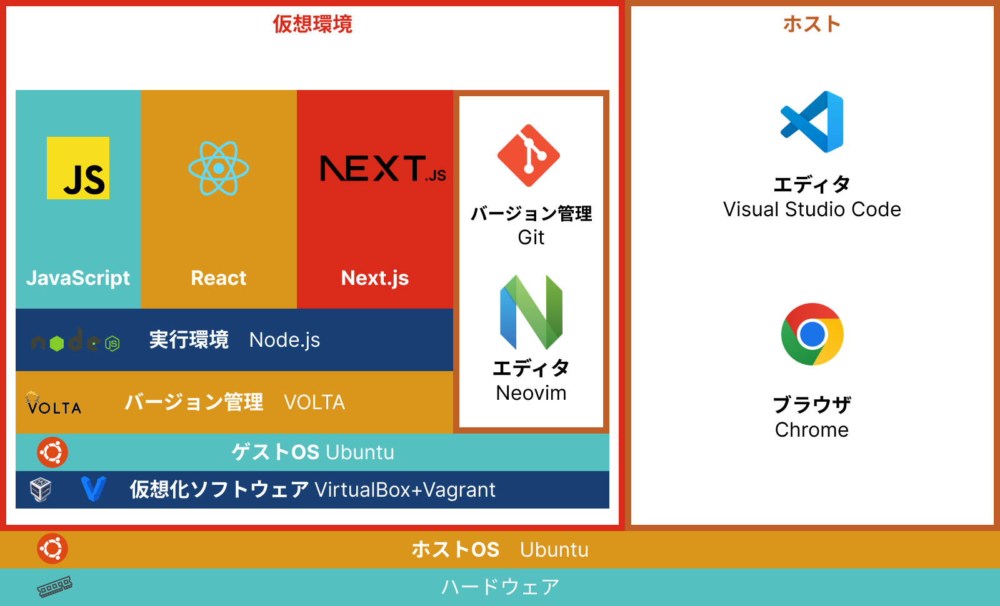

# 環境設定 Next.js/React

## 環境バージョン(2023)
### ホストPC
* Ubuntu22.04
* VirtualBox 7.0.12
* Vagrant 2.4.0

### 仮想環境
* Box ubuntu/jammy4
* Ubuntu22.04
* Volta 1.1.1
* Node.js 20.10
* npm 10.2.4
* Git 2.34.1
* Neovim 0.7.2



## 環境設定 手順

1. [環境設定 JavaScript](https://github.com/omas-public/JSFirst/blob/main/docs/environment.md)

2. アカウントの作成
	Setup1 アカウントの作成 [副読本 セットアップPDF](https://github.com/ebisucom/next-react-website/blob/main/setup.pdf) (副読本 P07)  
	* **[microCMS](https://microcms.io/)** ヘッドレスCMS (副読本 P11)  
		学校のメールアドレスで登録
	* **[Vercel](https://vercel.com/)** Webホスティングサービス (副読本 P13)  
		GitHubアカウント連携で登録
		同時複数人登録を行うとはじかれる可能性あり
	* **[Figma](https://www.figma.com/ja/)** コラボレーションデザインツール (副読本 P17)  
		学校のGoogleアカウント連携で登録  
	* ~~GitHub~~ 設定済み  
	* ~~Netlify~~ 設定不要  

3. サイトの公開
	Setup3 サイトの公開 [副読本 セットアップPDF](https://github.com/ebisucom/next-react-website/blob/main/setup.pdf) (副読本 P32)  

	* 教科書プロジェクト公開用のGitHub リポジトリを作成 (副読本 P33)  
		GitHubの初期設定  
		**リポジトリ名** next-react-website  
		**説明** Next.jsで構築したサイト  
		**公開設定** Private  

	* Next.jsプロジェクト作成(教科書 P23)  
		```
		$ npx create-next-app blog
		```

		* TypeScript? **No**  
		* ESLint? **No**  
		* Tailwind CSS? **No**  
		* src/ directory? **No**  
		* App Router? **No**  
		* import alias? **No**  

		```
		$ cd blog
		$ git config --global init.deaultBranch main
		$ git init
		$ git add -A
		$ git commit -m "first commit"
		$ git branch -M main
		$ git remote add origin リポジトリURL
		$ git push -u origin main
		```
		ブラウザからGitHubのリポジトリでプッシュされたか確認  


	* 36 Vercelの設定とサイトの公開 (副読本 P36)  
		Vercelのアクセス許可するリポジトリ 「Only select repositories」  
		リポジトリ名 next-react-website だけアクセス可能にする  


4. コンテンツの準備
	Setup4 コンテンツの準備 [副読本 セットアップPDF](https://github.com/ebisucom/next-react-website/blob/main/setup.pdf) (副読本 P32)  

	* microCMSでコンテンツのデータ準備(副読本 P48)  
	* 4.2 サービスを作成 サービス名「CUBE Blog」、サービスID「cube-blog-s23000」(学籍番号)   
	* 4.3 [APIカテゴリー](https://github.com/ebisucom/next-react-website/blob/main/import/api-categories.json)、[カテゴリーデータ](https://github.com/ebisucom/next-react-website/blob/main/import/contents-categories.csv)をインポート  
	* 4.4 [ブログAPI](https://github.com/ebisucom/next-react-website/blob/main/import/api-blogs.json)、[記事データ](https://github.com/ebisucom/next-react-website/blob/main/import/contents-blogs.csv)をインポート
	* 4.4 記事のデータをインポートしたあとに、画像データなどを挿入していく
	* 4.5 自分のAPIキーやIDを確認